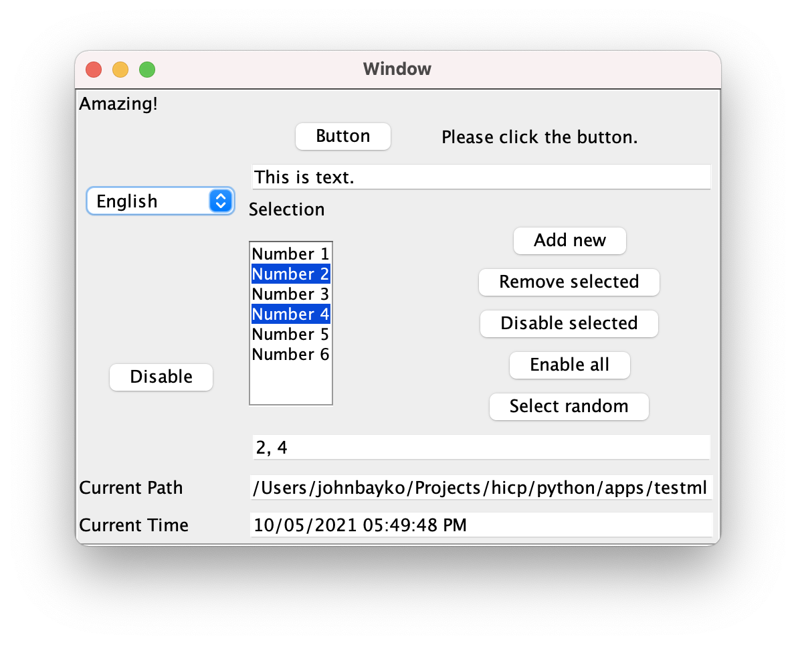

============
What's HICP?
============

HICP itself is a communication protocol for creating remote graphical user
interfaces. A client application receives requests to display elements, and
present content, and sends events that the user performs back to the server,
which runs an application that processes them, and can update the display in
response. This is done over a persistent connection, like ssh does, but how
that connection is established isn't specified.

The client's job is to receive requests, update the display, and send events,
with no other processing done. The protocol doesn't specify how to display the
requested components, beyond a general layout, and general functionality (e.g.
buttons which can be clicked, but can look like anything). The demo client I've
written is in Java, using the Swing components and layout managers.

I wrote a very simple server in Python called ``hicpd``, which only manages one
connection and one app at a time. An app is added by putting the Python code in
its own directory under the ``apps`` directory or a directory named
``default_app``. Any class found that inherits from the hicp ``App`` class is
added to the app list.

For app implementation I wrote a general Python "hicp" library to handle the
request message creation, and event message handling.

A shell script starts up the demo server. There's no defined port number, so
hicpd gets one from the server and prints it out.

The server continues accepting connections until the user enters "x" from the
keyboard to stop it (if an app is running, the server exits after the app
does).

There's another script to start the Java client.

   :alt Host <blank> Port 50850 User user1 Password * Application <blank>

A host can be specified, if blank it connects to localhost. The port here is
pasted from the server start message. User and password are demo values. If the
application field is left blank, the app found in default_app runs. Currently
that app displays the apps found in the ``apps`` subdirectories, with a button
to start the selected app.

There's a demo app looks like this:

   :alt Amazing! Button Please click the button. This is text. English

It shows many of the features implemented so far.

Clicking the button changes the text from "Please click the button" to "Thank
you. Don't click the button again." (you actually can click it again, it just
doesn't change the message).

Changing the contents of the text field also changes the label to "Text has
been changed.", and replaces the text you typed with "Woo-hoo!".

There is a selection list with items named "Number 1", "Number 2", and so on,
and a text field below which shows the ID of all items that have been selected.
The buttons to the side modify the list as described"

- Add new
- Remove selected
- Disable selected
- Enable all
- Select random

Below is the current path of the app that's running, added to show that each
app gets  directory with the Python code, and any resources it needs.

The time is displayed below that. It's updated in real time every second by the
app updating the text field contents.

To the left is a dropdown selection to select the language. Options are:

- English
- English (UK)
- Français

Most of the English text is specified as "EN", but the top left expression and
time format are specified as "EN/UK", so those change when "English (UK)" is
selected. All labels change when "Français" is selected, the editable text box
content doesn't because that is user specified.

.. image:: ../../../images/testml_fr.png
   :alt Sensationel! Bouton Veuillez cliquer sur le bouton. This is text. Français

The "Disable" button disables all test controls and changes the label to
"Enable". The test controls include everything on the right, not the language
control or "Disable" button itself.

Another demo is a calculator.

.. image:: ../../../images/calc_start.png
   :alt Calculator

Done as an exercise, it took a few hours, but there were no surprises. Each
button is positioned in a grid, and is assigned a handler (digits share a
handler class, as do operation keys). The result is evaluated with correct
precedence for multiply and divide versus add and subtract. The text field for
display is editable from the keyboard, or cut and paste, but an invalid number
simply won't perform any operation until a valid number is entered.

Overall, these apps behave exactly like a local desktop app, despite executing
on a server. There is more to add, but this gives a good overview of HICP
(<https://github.com/johnbayko/hicp>), and indicates what it will be capable of.
It's not meant to replace all web based applications, but it does provide a
very fast and lightweight alternative for anything that doesn't need the
precise layout and design capabilities of modern HTML.

