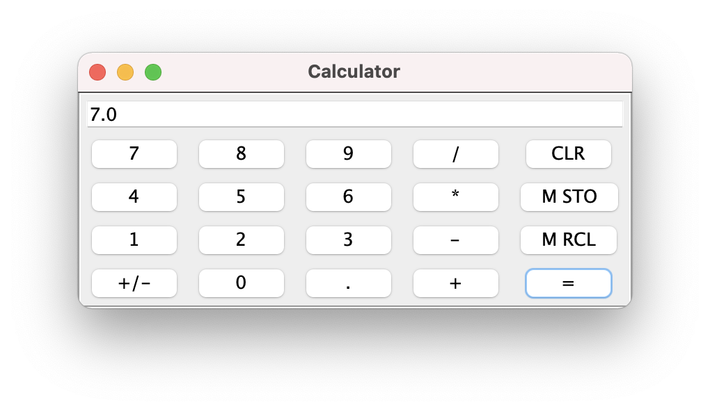

==========================
HICP in Python: Calculator
==========================

The code for HICP and the demo apps is available at
<https://github.com/johnbayko/hicp>. There's a Python library for creating
user interfaces and event handling for HICP.

An example is the calculator demo app.

   :alt Calculator

Apps are stored in individual directories under the `apps` directory of the
working directory where the server was started, or the path in the environment
variable `HICPPATH`. The app can include any resources it needs in that
directory.

::

    johnbayko@MacBook-Pro-2 python % ls apps/*/*.py
    apps/calc/calc.py	apps/test/test.py	apps/testml/testml.py
    
The ``HICP CONNECT`` message has an optional field to specify an app to run, if
the field is not included then the app in the ``default_app`` directory is
used.

The hicpd server considers an app to be any class which extends the hicp.App
class. To be useful, it must implement these methods:

``get_app_name()``
    Provides the name expected the in the ``CONNECT``
    message. The app is only created if it's run, so this must be a class method
    that can be called before then.

``get_app_info()``
    Provides additional information in an ``AppInfo`` object.
    It can be used to allow the user to select an app, so it also needs to be a
    class method that can be called before the app is actually created.
    ``AppInfo`` contains:

    ``app_name``
        Same as ``get_app_name()``.

    ``display_name``
        A ``TextSelector`` with the name to display to users, if needed.

    ``description``
        A ``TextSelector`` with the description of the app.

    ``TextSelector`` objects provide a way to organize text into groups and
    subgroups, if desired. The relevant string can be selected by calling the
    ``get_text()`` method, the ``group`` and ``subgroup`` fields can be
    omitted.

    An ``Appnfo`` object can be created given the ``display_name`` and
    ``description`` parameters in one of these forms:

    - A string.
    - A tuple of the form ``(string, optional group, optional subgroup)``.
    - A list of tuples.
    - A ``TextSelector`` object.

``connected(hicp)``
    Indicates that a connection from a client has been made, so
    the interface and event handlers must be set up.

::

    from hicp import HICP, Message, Panel, Window, Label, Button, TextField
    from hicp import App, AppInfo

    ...

    class Calc(App):
        @classmethod
        def get_app_name(cls):
            return 'calc'

        @classmethod
        def get_app_info(cls):
            app_name = cls.get_app_name()
            display_name = ('Calculator', 'en')
            desc = ('Demo calculator.', 'en')

            return AppInfo(app_name, display_name, desc)

        def connected(self, hicp):
            ...

The ``Calc`` app doesn't support different languages, but the ``AppInfo``
fields might be displayed in a multilingual setting, so they need to be a
``TextSelector``. The example here provides the display name and description as
only 'en' (English), so those will be returned for any language.

The first thing Calc does is create the class which holds the calculator state.
The ``connected()`` method exits once the display has been created, so any
information that needs to persist exists in other objects. In this case,
references are held by the event handlers which use it, so the ``Calc`` app
doesn't need to store it.

::

    class CalcData:
        def __init__(self):
            self.memory_value = 0.0
            self.reset()

        def reset(self):
            self.current_value = 0.0

            self.value_stack = []
            self.op_stack = [CalcOp.EQ] # EQ placeholder avoids checking len() == 0

            # Keep track of external display state
            self.new_value = True

        def perform_op(self, value_string, op):
            ...

    class Calc(App):
        ...
        def connected(self, hicp):
            calc_data = CalcData()
            ...

The ``perform_op()`` method is described later.

The next thing is to create the window to display the app.

::

        def connected(self, hicp):
            calc_data = CalcData()

            app_info = self.get_app_info()
            (text_group, text_subgroup) = hicp.get_text_group()

            window = self.new_app_window()
            window.set_text(app_info.display_name.get_text(text_group, text_subgroup), hicp)
            hicp.add(window)

``AppInfo`` stores ``display_name`` and ``description`` as ``TextSelector``
objects, which stores multiple text strings identified by group and optional
subgroup. Use of groups and subgroups is optional, but is used here for
illustration. They can represent language codes and region codes. The ``hicp``
object has text group and subgroup properties, which are retrieved here and
used to select the apps display name.

The window itself is just created, configured, then added to the ``hicp``
object, which handles forming the request and sending it to the client. The
``new_app_window()`` method is implemented by the ``App`` class, and just adds
a handler to the created window object which disconnects the app when the
window is closed.

A text field is added to the top to display the current value.

::

        def connected(self, hicp):
            ...
            display_field = TextField()
            display_field.set_content('0') # Initial value
            window.add(display_field, 0, 0)

The window layout is in the form of a grid, where rows and columns are sized as
needed. If the width of a component isn't specified, it expands right and down
into adjacent positions. In this case, it takes the entire width since there is
nothing else on the same row, but only one row since there are buttons below
it.

The grid isn't the only way to lay out components, panels can be added to a
window (and panels within panels). That allows panels with only vertical or
horizontal positioning to be combined with panels showing header or footer
layouts.

Buttons are added next. Digit buttons use a common handler, with the digit
passed in as a parameter.

::

    class DigitClickHandler:
        def __init__(self, calc_data, digit, display_field):
            self.calc_data = calc_data
            self.digit = digit
            self.display_field = display_field

        def update(self, hicp, event_message, digit_button):   
            content = self.display_field.get_content()
            if self.calc_data.new_value:
                # displayed value gets replaced with digit being entered.
                content = ''
                self.calc_data.new_value = False
            content += self.digit
            self.display_field.set_content(content)
            self.display_field.update()
    ...
    class Calc(App):
        ...
        def connected(self, hicp):
            ...
            digit = '7'
            button = Button()
            button.set_text(digit, hicp)
            button.set_handle_click(DigitClickHandler(calc_data, digit, display_field))
            window.add(button, 0, 1)

A handler can have three methods:

``feedback(self, hicp, event_message, digit_button)``
    Meant to allow the display to show that the event was received. Used when
    the event takes a while to process, so the result can't be displayed until
    then.

``process(self, event_message, digit_button)``
    Doesn't update the display. Meant to allow long event handling to take
    place while allowing the interface to continue to function.

``update(self, hicp, event_message, digit_button)``
    Meant to update the display with the results of the event handling.

A handler like this only needs to update the display, so doesn't implement
``feedback()`` or ``process()``.

This handler just updates or replaces the value in the display. When a
component's attributes are changed, the ``update()`` method needs to be called
to send a message with the changes to the client.

The "." and "+/-" keys are added the same way, and both update the display
(adding a "." or toggling a "-" character).

Operation keys (+, -, \*, /) also share a common handler, which is passed an
operator indicating which operation to perform.

::

    from enum import Enum
    ...
    class CalcOp(Enum):
        EQ = (1, '=')
        ADD = (2, '+')
        SUB = (2, '-')
        MUL = (3, '*')
        DIV = (3, '/')
        def __init__(self, precedence, text):
            self.precedence = precedence
            self.text = text
    ...
    class OpClickHandler:
        def __init__(self, op, display_field, calc_data):
            self.op = op
            self.display_field = display_field
            self.calc_data = calc_data

        def update(self, hicp, event_message, op_button):
            content = self.display_field.get_content()

            self.calc_data.perform_op(content, self.op)

            self.display_field.set_content(str(self.calc_data.current_value))
            self.calc_data.new_value = True

            self.display_field.update()
    ...
    class Calc(App):
        ...
        def connected(self, hicp):
            ...
            op = CalcOp.DIV
            button = Button()
            button.set_text(op.text, hicp)
            button.set_handle_click(OpClickHandler(op, display_field, calc_data))
            window.add(button, 3, 1)
            ...

``CalcOp`` is a Python enumeration which includes precedence and display text
information. The handler just passes the operation enumeration to ``CalcData``,
which performs the actual operation, then the hander updates the display.

``CalcData`` uses data and operation stacks to ensure "*" and "/" have
precedence over "+" and "-".

::

    class CalcData:
        ...
        def perform_op(self, value_string, op):
            try:
                value = float(value_string)
            except ValueError:
                # Cannot apply value_string to current value, so skip.
                return
            self.value_stack.append(value)

            # Evaluate any ops on stack
            while self.op_stack[-1].precedence >= op.precedence:
                if CalcOp.EQ == self.op_stack[-1]:
                    break

                stack_op = self.op_stack.pop()
                # Remember stack reverses things, left was pushed earlier so
                # comes off after right.
                right_value = self.value_stack.pop()
                left_value = self.value_stack.pop()

                if CalcOp.ADD == stack_op:
                    new_value = left_value + right_value
                elif CalcOp.SUB == stack_op:
                    new_value = left_value - right_value
                elif CalcOp.MUL == stack_op:
                    new_value = left_value * right_value
                elif CalcOp.DIV == stack_op:
                    new_value = left_value / right_value

                self.value_stack.append(new_value)

            if self.op_stack[-1].precedence < op.precedence:
                self.op_stack.append(op)

            # For display
            self.current_value = self.value_stack[-1]

The equal sign "=" is treated as an operator, and is used to indicate an end to
the operations that are needed to be performed.

The value in the display is checked for validity. Although using the on screen
keys ensures only valid numbers can be entered, the text field is editable so
things can be entered from the keyboard, or pasted into the display, and those
might not be numbers, so that has to be taken into account.

The rest of they keys (clear, memory store, and memory recall) are added the
same way, with similar handlers. At the end, the window is made visible.

::

        def connected(self, hicp):
            ...
            window.set_visible(True)
            window.update()

That's basically the whole example.

There's no support for designing a form for the interface. The library could do
that, but I just wanted something quick that was close to how the HICP protocol
worked. HICP itself isn't form based because that would limit the ability to
dynamically update the display, which is the main thing that distinguishes it
from using HTML and HTTP requests.

It's not as refined as web based applications, but those have had over 25 years
of work done on them by untold numbers of people. I think for just me working
on it for a few months, this is a good start.
