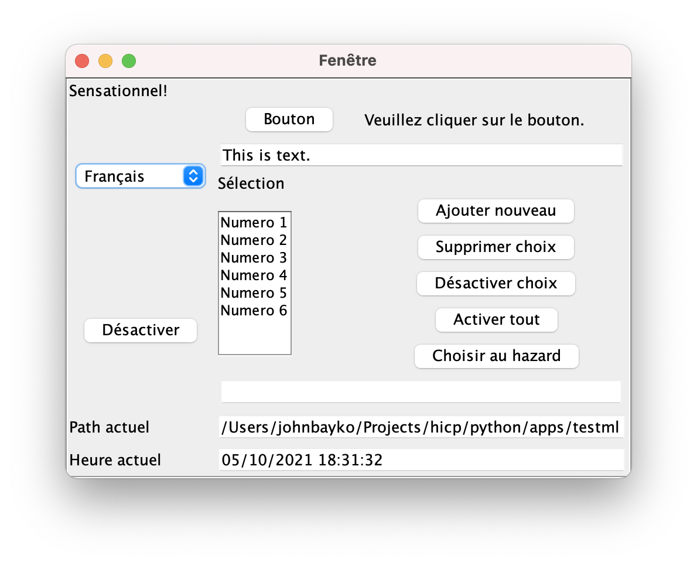

=========================
HICP in Python: Languages
=========================

The code for HICP and the demo apps is available at
<https://github.com/johnbayko/hicp>. GThis describes the Python library for
creating user interfaces, and how it handles the multiple language feature of
HICP.

In Holistic Interface Control Protocol (HICP) clients text is stored in a
library, and the ID of the text items are used
to specify text shown in labels, buttons, selection lists, and so on.
The text in the library can be replaced by a different language, which would
appear everywhere it was used.

The HICP Python library supports this in a number of ways, but also supports
applications that don't need multilingual support, as well as those which might
only need to support a small number of languages.

Specify text as strings
=======================

In the Python HICP library, there are several ways to handle text in
components. The simplest allows the text strings to be specified explicitly,
and the library handles the task of assigning an ID, adding it to the text
library on the client, and adding a reference to the particular component.

::

    button = Button()
    button.set_text('Hello', hicp)
    button.set_handler(EventType.CLICK, HelloClickHandler())
    window.add(button, 4, 1)

The ``hicp`` parameter must be passed in to allow the component to add the
string to the app version of the text library managed by ``hicp``.

The ``hicp`` object has a current text group and subgroup, which can be used
for anything, but is convenient to specify language and region codes, such as
"en", "en-us", "en-gb", "en-ca". There is a default "" group and subgroup if no
language is specified, otherwise the current language can be set with
``hicp.set_text_group()``.

Assign string to a text ID
==========================

The text for an ID can be explicitly added to the ``hicp`` library, where the
ID can be used to set the text for a component. This can be done for a single
string using ``hicp.add_text()``, or for a ``dict`` using
``hicp.add_all_text()``.

::

    WINDOW_TITLE_ID = 1
    BUTTON_TEXT_ID = 2
    BLANK_TEXT_ID = 3
    GREETING_TEXT_ID = 3
    ...
    hicp.add_all_text({
        self.WINDOW_TITLE_ID : 'Greeting App',
        self.BUTTON_TEXT_ID : 'Hello',
        self.BLANK_TEXT_ID : '',
        self.GREETING_TEXT_ID : 'Hello to you too.',
    })
    ...
    greeting_label = Label()
    greeting_label.set_text_id(self.BLANK_TEXT_ID)
    window.add(greeting_label, 0, 0)

    button = Button()
    button.set_text_id(self.BUTTON_TEXT_ID)
    button.set_handler(EventType.CLICK, ButtonHandler(greeting_label))
    window.add(button, 0, 1)

In this example, IDs are specified in code, but could be assigned by an
``Enum`` ``auto()`` function.

You could write code to manage different languages this way, replacing the
strings in the ``hicp`` object when the language is changed, or if changing the
language after starting is not supported by the app, the strings can be added
once.

Assign text ID to a string
==========================

When text isn't static, such as generated from data or loaded from a file or
database, ``hicp`` can assign an unused ID to it by using
``hicp.add_text_get_id()``.

::

    # 'Good Monday/Tuesday/etc... morning'
    greeting_text = 'Good ' + date.today().strftime('%A') + ' morning'
    GREETING_TEXT_ID = hicp.add_text_get_id(greeting_text)

In a case like this, there will be a new ID assigned any time ``greeting_text``
is changed and added again. The old text will be just taking up space, unused.
So it would be better to explicitly set the new text using the text ID for the
text being replaced.  If the text has been added before, the old ID will be
returned. That might not be what you want if the text is changed later.

::

    THEME_ALPHA_ID = 1
    THEME_DELTA_ID = 2
    THEME_LAMBDA_ID = 3
    ...
    hicp.add_all_text({
        self.THEME_ALPHA_ID : 'Red',
        self.THEME_DELTA_ID : 'Orange',
        self.THEME_LAMBDA_ID : 'Blue',
    })
    ...
    fruit_id = hicp.add_text_get_id('Orange')
    ...
    hicp.set_text(THEME_DELTA_ID, 'Green')

In this case, ``fruit_id`` would initially refer to "Orange", but later refer
to "Green". This would be unlikely to ever happen, but will be confusing when
it does.

Using text groups
=================

Text for groups and subgroups can be added in a similar way. The difference is
that a list of tuples is provided instead of just a string. A text ID is
returned. This is useful in cases where a small number of languages need to be
supported, it would quickly be unmanagable for very many.

::

    NAME_ID = hicp.add_groups_text_get_id([
            ("Name", "en"),
            ("Nom", "fr"),
            ("Nombre", "es"),
        ])

The tuple can have a text group or a group and a subgroup in cases where there
is a regional difference.

::

    label_text_id = hicp.add_groups_text_get_id([
            ("Colour", "en"),
            ("Color", "en", "us"),
        ])

    leisure_time_id = hicp.add_groups_text_get_id([
            ("Week-end", "fr"),
            ("Fin de semaine", "fr", "ca"),
        ])

The ``hicp`` object manages the text groups, which can be set and retrieved.

::

  hicp.set_text_group("es")

  hicp.set_text_group("es", "mx")

  (group, subgroup) = hicp.get_text_group()

The tuple that most closely matches the current hicp group and subgroup is used
for the current text and sent to the client for display, the rest are stored.
If the text group or subgroup is changed, then the text most closely matching
the new group replaces the previous text.

Text groups for components
==========================

For convenience, you can set a text group on a component directly. The ID is
stored internally, but otherwise operates the same as above. The only unusual
part is that the ``hicp`` object must be passed as a parameter so it can be
updated.

::

  button.set_groups_text([
          ("Start", "en"),
          ("Commencer", "fr"),
          ("Comienzo", "es"),
      ], hicp)

Example
=======

There is a test app which shows this in action.

.. image:: ../../../images/testml_start.png
   :alt Amazing! Button Please click the button. This is text. English

A dropdown component allows a different language to be selected.

   :alt Sensationel! Bouton Veuillez cliquer sur le bouton. This is text. Français

The complete code is in ``python/apps/testml``.

