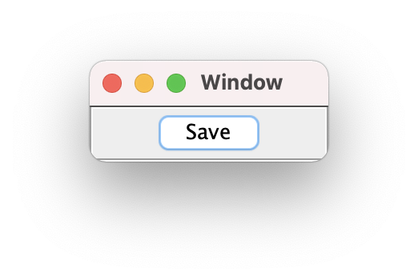
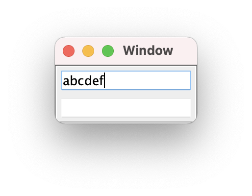

==================================
HICP in Python: Component overview
==================================

The code for HICP and the demo apps is available at
<https://github.com/johnbayko/hicp>. This is a brief overview of the GUI
components that the Python HICP library currently implements, and how to use
them in an app.

Window
======

The basic component that all others are added to is a ``Window``. HICP doesn't
specify what it looks like, so on mobile devices it could be a sliding screen
or tab of some sort. The only requirements are that it can optionally display
text to identify or describe it, and other nonw-``Window`` components can be
added to it.

It generates a ``CLOSE`` event, but the app has to actually close it with an
event handler.

The ``App`` class can provide a default window with the ``new_app_window()``
method, which is a plain window which disconnects the app when closed.

::

    def connected(self, hicp):
        window = self.new_app_window()
        window.set_text('Window', hicp)
        hicp.add(window)

        window.set_visible(True)
        window.update()

   :alt Window

Label
=====

A label is just a string of text which is displayed on a single line. It can be
changed, but doesn't generate events on its own.

::

    greeting_text = 'Good ' + date.today().strftime('%A') + ' morning'
    greeting_id = hicp.add_text_get_id(greeting_text)

    label = Label()
    label.set_text_id(greeting_id)

    window.add(label, 0, 0)

   :alt Good Tuesday morning

Panel
=====

A panel allows other components to be added to it for display the same way as
the interior of a ``Window``. It's used for managing the layout of components.

::

    panel = Panel()
    window.add(panel, 0, 0)

    label = Label()
    label.set_text('upper left', hicp)
    panel.add(label, 0, 0)

    label = Label()
    label.set_text('lower left', hicp)
    panel.add(label, 0, 1)

    panel = Panel()
    window.add(panel, 1, 0)

    label = Label()
    label.set_text('right', hicp)
    panel.add(label, 0, 0)

   :alt upper left lower left right

Button
======

A button has a text label and generated a ``CLICK`` event when activated by the
user. A handler class can be added to it.

Handlers can have three stages:

``feedback``
    Can modify the display to le the user know an event has been received.

``process``
    Perform operations which take a long time, while allowing events that
    affect the display to continue being processed.

``update``
    Update the display to the final state.

Only those stages that are used need to be implemented (a handler could omit
all stages, but wouldn't be very useful). A handler has no other requirements,
so can be as complex as needed internally, including calling other handlers. In
that case it's assumed only the same stage will be called (e.g. ``process()``
will call ``process()``, never ``feedback()`` or ``update()``), but this is not
enforced.

::

    class SaveHandler:
        def __init__(self, button, save_id, saving_id, data_object):
            self.__button = button
            self.__save_id = save_id
            self.__saving_id = saving_id
            self.__data_object = data_object

        def feedback(self, hicp, event, component):
            self.__button.set_text_id(self.__saving_id)
            self.__button.set_events(component.DISABLED)
            self.__button.update()

        def process(self, event, component):
            self.__data_object.save()

        def update(self, hicp, event, component):
            self.__button.set_text_id(self.__save_id)
            self.__button.set_events(component.ENABLED)
            self.__button.update()

    class ThisApp(App):
        ...
        def connected(self, hicp):
            ...
            save_id = hicp.add_text_get_id('Save')
            saving_id = hicp.add_text_get_id('Saving...')
            save_button = Button()
            save_button.set_text_id(save_id)
            save_button.set_handler(
                    EventType.CLICK,
                    SaveHandler(save_button, save_id, saving_id, data_object)
                )
            window.add(save_button, 0, 0)

   :alt Save button

In this example, the button will be disabled and show different text while
saving so that the user doesn't try to activate it again until it's finished.

   :alt Disabled Save button

TextField
=========

A ``TextField`` displays a single line of changable content, and can allow the
user to modify the contents.

If disabled, a ``TextField`` shows the contents, but the user can't change
them.  When enabled, a ``CHANGED`` event is sent to the app when editing is
finished.

An example of a ``DISABLED`` ``TextField`` shows the current time, as set from
a handler that extends the ``TimeHandler`` class. Time events don't come from
displayed components, so have no ``feedback()`` or ``update()`` stages, just
``process()``, and there is no ``component`` parameter to the ``process()``
method. Time events are generated by ``hicp`` which the time handler is added
to.

The handler must provide information on what time events it expects by
implementing a ``get_infp()`` method to return a ``TimeHandlerInfo`` object.
That object indicates the time period in seconds, and whether the event should
repeat or not.

::

    class ClockHandler(TimeHandler):
        def __init__(self, clock_text):
            self.clock_text = clock_text

            # Display now as initial time, instead of blank for a second.
            self.update_clock_text(datetime.now())

            self.time_info = TimeHandlerInfo(1, is_repeating=True)

        def get_info(self):
            return self.time_info

        def process(self, event):
            # Update clock_text from event time.
            self.update_clock_text(event.event_time)

        def update_clock_text(self, new_time):
            self.clock_text.set_content(
                new_time.isoformat(sep=' ', timespec='seconds') )
            self.clock_text.update()

   :alt Current time

An exmple with two ``TextField`` components shows simple change handling. Text
can be entered into the first one, and is copied to the second.

::

    class CopyHandler:
        def __init__(self, to_text):
            self.__to_text = to_text

        def update(self, hicp, event, from_text):
            copy_text = from_text.get_content()

            self.__to_text.set_content(copy_text)
            self.__to_text.update()

    class ThisApp(App):
        ...
        def connected(self, hicp):
            ...
            from_text = TextField()
            window.add(from_text, 0, 1)

            to_text = TextField()
            to_text.set_events(TextField.DISABLED)
            window.add(to_text, 0, 2)

            # Handler needs to know to_text field, so add it to from_text here.
            from_text.set_handler(
                EventType.CHANGED,
                CopyHandler(to_text)
            )

   :alt Text field abcdef

After editing is finished:

   :alt Text field abcdef abcdef

``TextField`` content can also have attributes, like italic, bold, or
underline, as well as font sizes, but the component does not need to support
those. However, it does need to preserve those attributs as the content is
edited when a change event is sent back. In this example, the attributes can be
completely ignored.

Selection
=========

Selecting from multiple items can be done with a ``Selection`` component. The
items available for selection can be displayed in different formats, and can
allow either single or multiple items to be selected.

A list of ``SelectionItem`` objects can be added to a ``Selection`` component
to define the selectable items. A ``SelectionItem`` contains:

``item_id``
    An arbitrary integer identifying the selection item.

``text_id``
    A text ID to display to identify the item available to be selected.

``events``
    Specifies if the item can be selected or unselected to generate
    changed events. Can be:

    ``Selection.ENABLED``
        (Default) Item can be selected or unselected.

    ``Selection.DISABLED``
        Item cannot be selected or unselected.

    ``Selection.UNSELECT``
        Item can be unselected if selected, but unselected items cannot be
        selected.

``item``
    An arbitrary object associated with this item, so it can be selected
    without needing to look up an object using the item ID.

A ``Selection`` has several presentation formats:

``Selection.SCROLL``
    A vertically list of items that can be scrolled if longer than available
    space.

``Selection.TOGGLE``
    Items are arrayed vertically in one or more columns.

``Selection.DROPDOWN``
    A single item can be selected from a list that drops down when the user
    changes the selection.

The ``Selection.SCROLL`` presentation is default.

::

    class ThisApp(App):
        ...
        def connected(self, hicp):
            ...
            # Specify text ID for each colour name.
            color_list = [
                    (1, 'Red'),
                    (2, 'Yellow'),
                    (3, 'Orange'),
                    (4, 'Green'),
                    (5, 'Blue'),
                    (6, 'Indigo'),
                    (7, 'Violet'),
                ]
            for (color_id, color_name) in color_list:
                hicp.add_text(color_id, color_name)

            color_selection = Selection()
            color_item_list = []
            for (color_id, color_name) in color_list:
                # For simplicity, use text ID as item ID,
                # normally they'd be different.
                color_item = SelectionItem(
                    item_id = color_id,
                    text = color_id,
                    item = color_name
                )
                color_item_list.append(color_item)
            color_selection.set_items(color_item_list)
            window.add(color_selection, 0, 0)

Some properties, like the desired height of the list and whether single or
multiple selections are allowed, can be specified as well.

An example of a handler which lists the selected items in a text field below:

::

    class ColorHandler:
        def __init__(self, color_field):
            self.__color_field = color_field

        def update(self, hicp, event, selection):
            selected_items = selection.get_selected_item_list()
            selected_colors = [i.item for i in selected_items]
            selected_color_names = ', '.join(selected_colors)

            self.__color_field.set_content(selected_color_names)
            self.__color_field.update()

    class ThisApp(App):
        ...
        def connected(self, hicp):
            ...
            color_field = TextField()
            color_field.set_events(TextField.DISABLED)
            window.add(color_field, 0, 1)

            color_selection.set_handler(
                EventType.CHANGED,
                ColorHandler(color_field)
            )

   :alt Selection scroll Orange, Blue

The dropdown presentation only allows a single item to be selected at a time.

::

        color_selection.set_items(color_item_list)
        # Change presentation.
        color_selection.set_presentation(Selection.DROPDOWN)
        window.add(color_selection, 0, 0)

   :alt Selection dropdown Blue

The toggle presentation displays all items without scrolling as individually
togglable buttons. They can be arranged in columns by either setting the height
to be smaller than the number of items, or setting the width to the number of
columns wanted.

::

        color_selection.set_items(color_item_list)
        color_selection.set_presentation(Selection.TOGGLE)
        # Change height.
        color_selection.set_height(6)
        window.add(color_selection, 0, 0)

   :alt Selection checkboxes 6 high Orange, Blue

::

        color_selection.set_items(color_item_list)
        color_selection.set_presentation(Selection.TOGGLE)
        # Change width.
        color_selection.set_width(2)
        window.add(color_selection, 0, 0)

   :alt Selection checkboxes 2 columns Orange, Blue

Selection mode is ``MULTIPLE`` by default for list and toggle presentations,
but can be changed to ``SINGLE``.

::

        color_selection.set_items(color_item_list)
        color_selection.set_presentation(Selection.TOGGLE)
        # Change to single selection mode.
        color_selection.set_selection_mode(Selection.SINGLE)
        window.add(color_selection, 0, 0)

   :alt Selection radio buttons Blue

Summary
=======

This is a brief overview of the components implemented so far. It's not meant
to be a comprehensive manual, but should give an idea of what using HICP in
Python is like.

